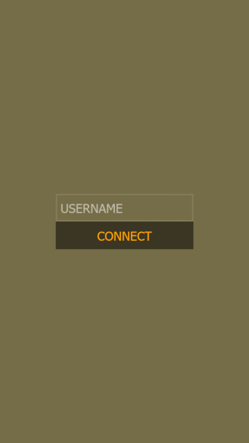

<h1>MSG - Tornado WebSocket Chat</h1>

<h3>Stack:</h3>
<ul>
  <li>Python</li>
  <li>Tornado</li>
  <li>WebSocket</li>
  <li>Javascript</li>
  <li>Vue</li>
</ul>

<h3>Dependencies:</h3>

See requirements.txt for dependencies.

<h3>Deployment:</h3>
<ol>
  <li>Clone repository into Python virtual environment and install dependencies: <code>pip install -r requirements.txt</code></li>
  <li>Create keys.py file and setup keys required in app_config.</li>
  <li>Run with: <code>python manage.py runserver</code></li>
</ol>

<h3>Licence:</h3>

MIT Licence
